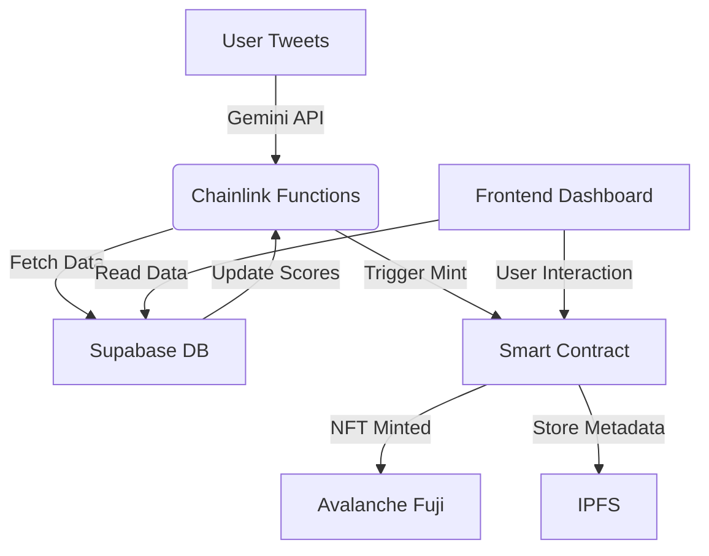

# 🐦 **LoyalTweets**  
Twitter-Powered NFT-Based Loyalty Programs  

> **Empower creators and users with blockchain-backed rewards for social media engagement.**

---

## 📌 **Overview**  
**LoyalTweets** bridges Twitter (X) activity and Web3 by rewarding users with NFTs tied to their content creation and engagement metrics. Using **Gemini** (Twitter API client), **Chainlink Functions**, and **Supabase**, it dynamically calculates user loyalty scores and mints NFTs on the **Avalanche Fuji testnet**. This project enables brands and communities to gamify social interactions, fostering deeper user retention.

This repo uses the ElizaOS Agentic AI framework to create an AI agent that interacts with your input (via terminal or twitter!).
You give the agent a gift code and your wallet address and it will mint a reward NFT for you on the Avalanche Fuji Network.

---

## 🔧 **Key Features**  
- **Twitter Integration**: Track tweets, likes, retweets, and mentions via Gemini.  
- **Dynamic NFT Rewards**: Mint loyalty NFTs based on engagement scores calculated off-chain.  
- **Chainlink Functions**: Fetch real-time Twitter data and compute rewards on-chain.  
- **Avalanche Fuji Deployment**: Scalable, low-cost EVM-compatible blockchain for testing.  
- **Supabase Backend**: Store offline user activity, engagement metrics, and NFT history.  

---

## 🏗️ **Architecture**  


---

## 🚀 **Getting Started**  

### **1. Prerequisites**  
- Node.js (v18+)  
- Hardhat (Ethereum development)  
- Chainlink Functions CLI  
- Supabase account (for database)  
- Avalanche Fuji testnet credentials  
- ElizaOS Agentic AI framework 
- Twitter Developer API keys (via Gemini)  

### **2. Installation**  
```bash
# Clone the repo
git clone https://github.com/holyaustin/LoyalTweets.git
cd LoyalTweets

# Install dependencies
npm install
```

### **3. Configuration**  
Create a `.env` file with:  
```env
GEMINI_API_KEY=your_twitter_api_key
SUPABASE_URL=your_supabase_url
SUPABASE_ANON_KEY=your_supabase_anon_key
AVALANCHE_FUJI_RPC_URL=your_fujinet_rpc_url
PRIVATE_KEY=your_wallet_private_key
```

### **4. Deploy Smart Contract**  
```bash
npx hardhat deploy --network fuji
# Output contract address to update frontend and Chainlink functions

Avalanche Fuji Testnet contracct address : 0x8c62a330fAEB4a5cfd6458464fd41a918d663025

https://testnet.snowscan.xyz/address/0x8c62a330faeb4a5cfd6458464fd41a918d663025#code

https://snowtrace.io/address/0x8c62a330fAEB4a5cfd6458464fd41a918d663025
```


### **5. Set Up Supabase**  
- Create a table `user_activity`:  
  ```sql
  CREATE TABLE user_activity (
    id UUID PRIMARY KEY,
    user_id TEXT NOT NULL,
    tweet_id TEXT NOT NULL,
    engagement_score INT NOT NULL,
    claimed BOOLEAN DEFAULT FALSE
  );
  ```

- Configure Row Level Security (RLS) for secure access.

### **6. Run Chainlink Functions**  
- Deploy the Chainlink Function to process Twitter data:  
  ```bash
  chainlink functions simulate --contract YourFunctionConsumerAddress --network fuji
  ```

- Update the function to query Supabase and compute rewards.

---

## 🧪 **Usage**  

### **For Users**  
1. Connect MetaMask and Twitter account via Gemini.  
2. Tweet content with a community-specific hashtag (e.g., `#LoyalTweets`).  
3. Chainlink Functions trigger NFT minting based on engagement (likes, retweets, mentions).  
4. Claim NFTs directly from the frontend dashboard.  

### **For Developers**  
- **Frontend**: Fetch user NFTs and engagement stats from Supabase.  
- **Smart Contract**: Modify `LoyalTweets.sol` to adjust reward tiers or NFT metadata.  
- **Chainlink**: Update `functions-script.js` to refine engagement scoring logic.  

---

## 📊 **Example Workflow**  
1. User posts a tweet with `#LoyalTweets`.  
2. Gemini detects the tweet and stores metadata in Supabase.  
3. Chainlink Functions query Supabase for engagement scores.  
4. If score threshold met, smart contract mints an NFT and updates Supabase.  
5. User claims the NFT via the frontend.  

---

## 🧩 **Tech Stack**  
- **Frontend**: React.js + Web3Modal  
- **Backend**: Supabase (PostgreSQL)  
- **Blockchain**: Solidity (Hardhat) on Avalanche Fuji  
- **Oracles**: Chainlink Functions for off-chain data  
- **Twitter API**: Gemini for real-time social tracking 
- **Eliza Framework**: ElizaOS Agentic AI framework 


---

## 🛡️ **Security**  
- All Twitter data is verified via Chainlink Functions.  
- NFT minting requires signature validation from Chainlink oracle.  
- Supabase RLS ensures data integrity for user activity logs.  

---

## 📚 **Contributing**  
1. Fork the repo.  
2. Create a feature branch (`git checkout -b feature/new-loyalty-tier`).  
3. Commit changes and test thoroughly.  
4. Open a pull request with detailed description.  

---

## 📄 **License**  
MIT License – See [LICENSE](LICENSE) for details.  

---

## 🤝 **Contact**  
- **Twitter**: [@LoyalTweetsDAO](https://twitter.com/holyaustin)  
- **GitHub**: [github.com/your-username/LoyalTweets](https://github.com/holyaustin/LoyalTweets)  
- **Email**: support@loyaltweets.io  

---

### **✨ LoyalTweets: Where Social Influence Meets Blockchain Rewards**  
**Follow us on Twitter, earn NFTs, and own a piece of the community.**  

---

**README Badge Suggestions**  
[](https://github.com/your-username/LoyalTweets)  
[](https://github.com/your-username/LoyalTweets)  
[](https://supabase.com/)  
[](https://chain.link/)  

---
